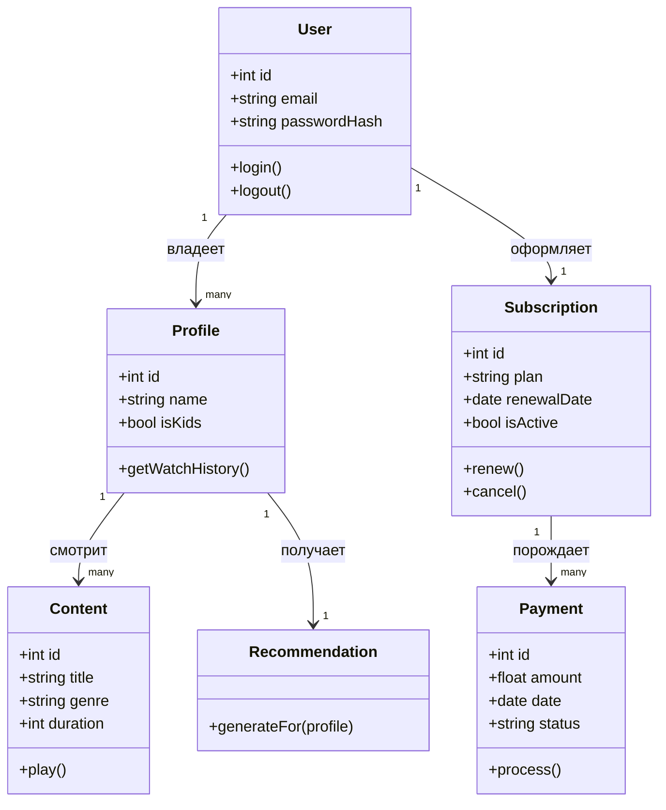

```mermaid
classDiagram
    class User {
        +int id
        +string email
        +string passwordHash
        +login()
        +logout()
    }
    class Profile {
        +int id
        +string name
        +bool isKids
        +getWatchHistory()
    }
    class Subscription {
        +int id
        +string plan
        +date renewalDate
        +bool isActive
        +renew()
        +cancel()
    }
    class Content {
        +int id
        +string title
        +string genre
        +int duration
        +play()
    }
    class Payment {
        +int id
        +float amount
        +date date
        +string status
        +process()
    }
    class Recommendation {
        +generateFor(profile)
    }

    User "1" --> "many" Profile : владеет
    User "1" --> "1" Subscription : оформляет
    Subscription "1" --> "many" Payment : порождает
    Profile "1" --> "many" Content : смотрит
    Profile "1" --> "1" Recommendation : получает
```
